#  Veeam Hands-on Lab for Microsoft Azure
## Login to Veeam VM
1. Copy the Public IP address from the VM and Note the **Username** and **Password** from the azure portal
2. Open the new browser and paste the value copied below and replace the **IPADDRESS** with the Veeam VM IP address
  `````
  https://IPADDRESS
  `````

3. Click on the **advance**
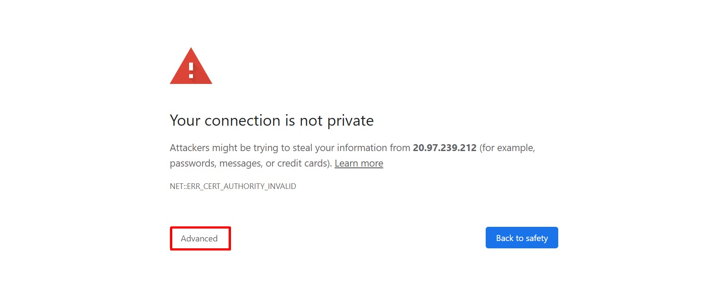
4. Click on the **click on processed to IP**
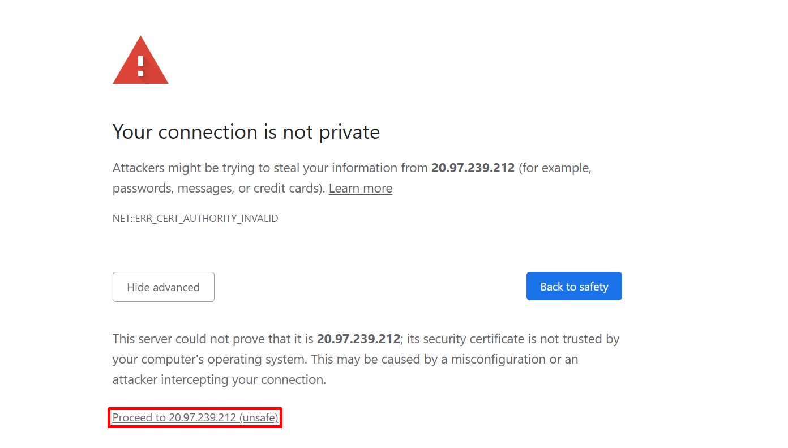
5. Enter the **Username** and **Password** and click on Login

6. Check all the check boxes in the licence agreement and click on **Accept** and login into the VM


## Add a Microsoft azure account
1. Click on add a microsoft azure account first

2. Click on **Add**

3. Enter the **Name**, **Description** and click on the **Next**

4. In the **Service Account Type** click on **Specify the exisiting service account**

5. Copy the **TenantID**, **Application ID** and **Secret** of service principal from environment details Tab
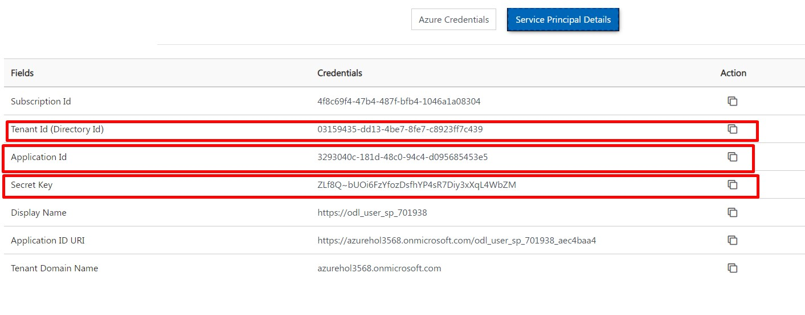
6. Paste the Copied values in the respective fields and click **Next**

7. Move to the **Summary** and click **Finish** to setup the microsoft account


## Add the Workers to Workspace
1. Go to **Getting Started page** and **click on Review workers configuration**
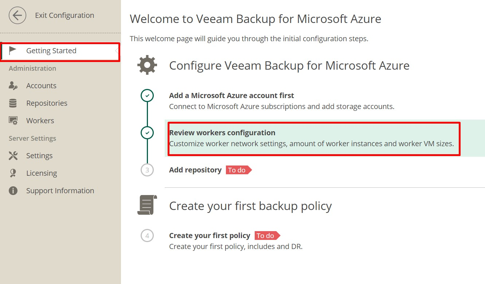
2. Click on **+Add**

3. Click on **region** and select the region of the resource group and **Apply** and Click **Next**
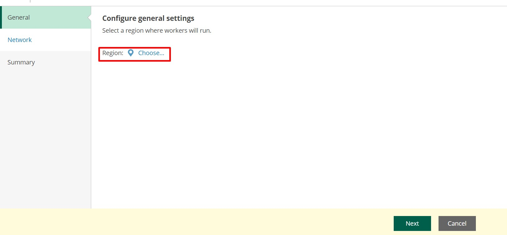
4. Select the **Virtual Network**, **Subnet** and **Network security Group** and **Next**
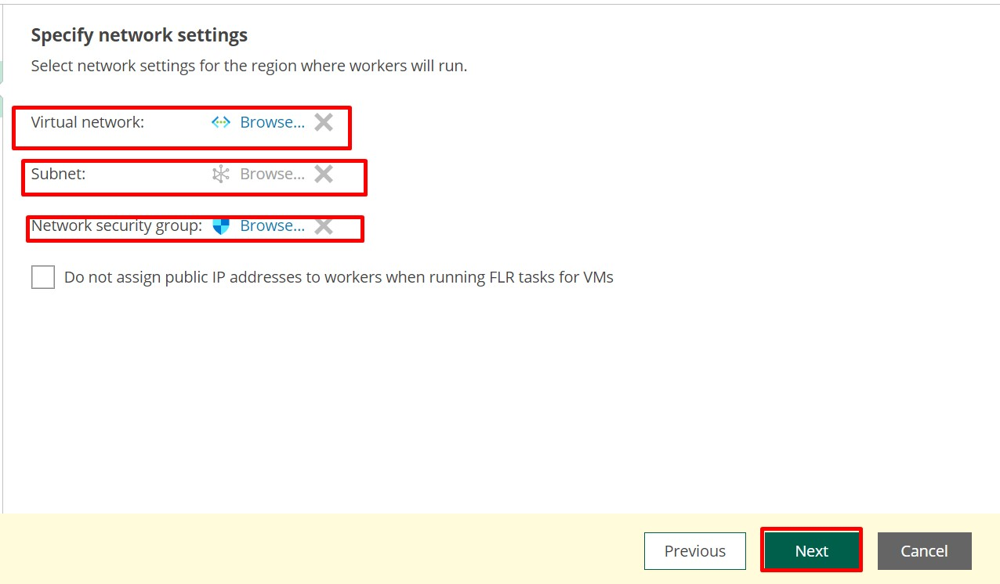
5. Click on **Finish**

6. Click on **profile** and **+Add**

7. Select the **Region**, select the proper region and click on **add** and click on **Next**
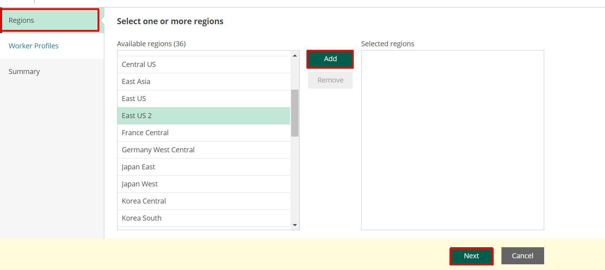
8. Move to the **worker profile** and click **Next**

9. Go to **summary** and click **Finish**

10. Move to **instance** tab and verify instance is created if it is still in creating state wait till it move to created state


## Add the repository
1. Move to **Getting Started** page and click on **Add repository**
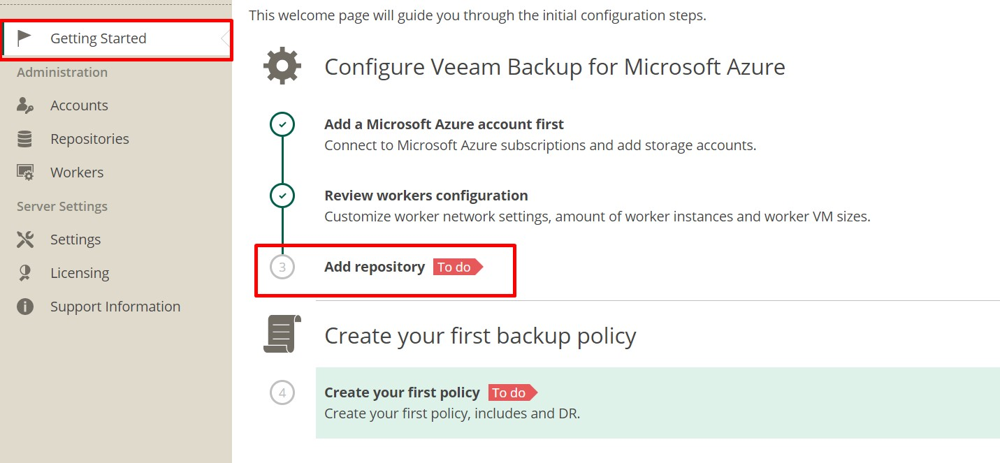
2. Click on **+Add**

3. Enter the **Name** and **Discription** and Click **Next**

4. Select the **storage account**, **Conatiner** and create the **NewFolder** and **Next**
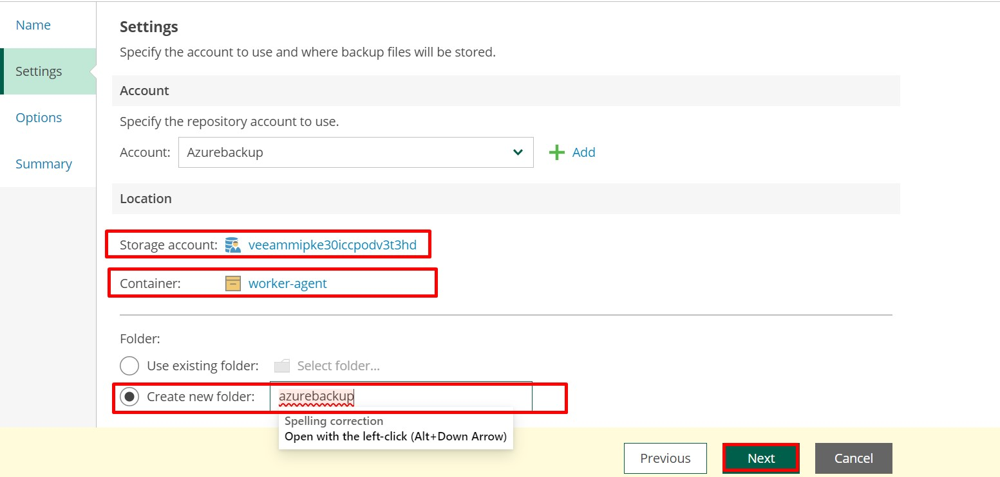
5. Select the **Option** and click **Next**

6. Click on **Summary** and **Finish**

7. Verify that the repository is creation in success state.


## Create Backup policy for Virtual Machines
1. Move to **Getting started page** and **Create your first policy**

2. Click on **+Add**

3. Click on **PolicyInfo** enter the **Name** and **Description** and click **Next**
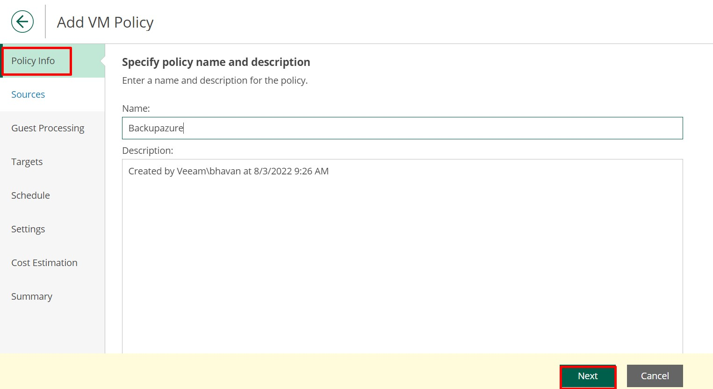
4. Select the **Azure Active Directory**, select the directory which is given in the azure and select the **Region**

5. Select the  **All resource**

6. Select the **protect the following resources** and **Browse to select the specific resource from the global list**

7. Select the checkbox for virtual machine and click on **ADD**
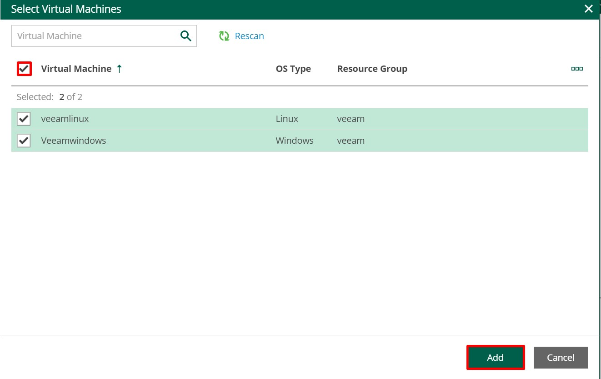
8. Click on **APPLY**
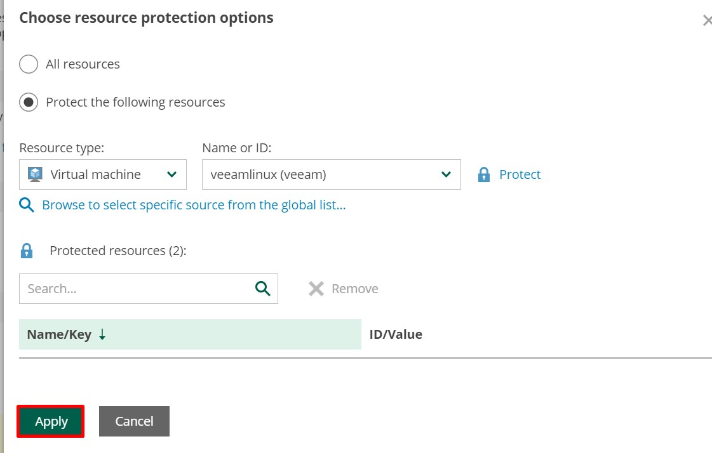
9.Click on **Next**

10. Move to **Guest processing** and **Enable application aware snapshots** and click **Next**
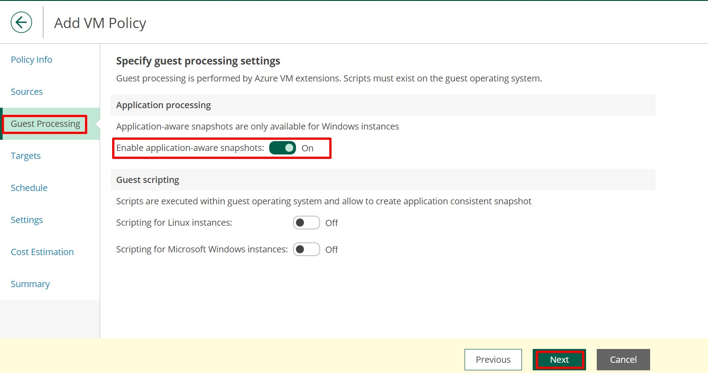
11. Select the **Targets** and **Enable Backup:on** click **Next**

12. Select the **Schedule**, **Daily Retension:On** and **Edit Daily Settings**

13. Select the **Repository** : **Azure Backup**, Click on **Apply** and Click **Next**
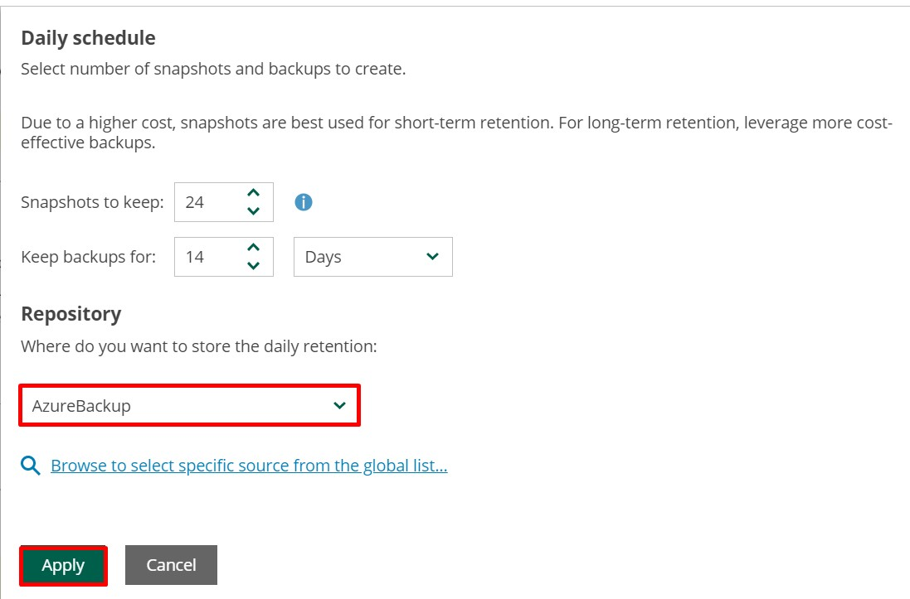
14. Select the **Settings** click **Next**

15. Select the **Cost Estimation** and review the cost estimation and click **Next**

16. Select the **Summary** and review the summary and click on **Finish**

17. Select the **checkbox** for the priority and click on **Start**

18. Verify that the backup and snapshot creation **success**
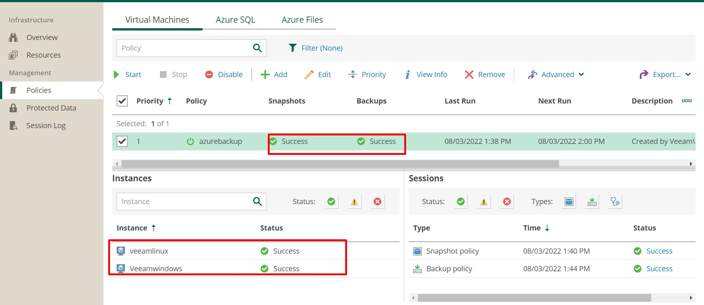

## Delete the Windows Virtual Machines
1. Login to the Azure Portal Using the credentials given in the Environment details.
2. Search for the Virtual Machine in search tab select the  **Veeamwindows** VM and **Delete**.

3. Select the **Veeamwindows** and check the checkbox for Confirmation and click **delete**
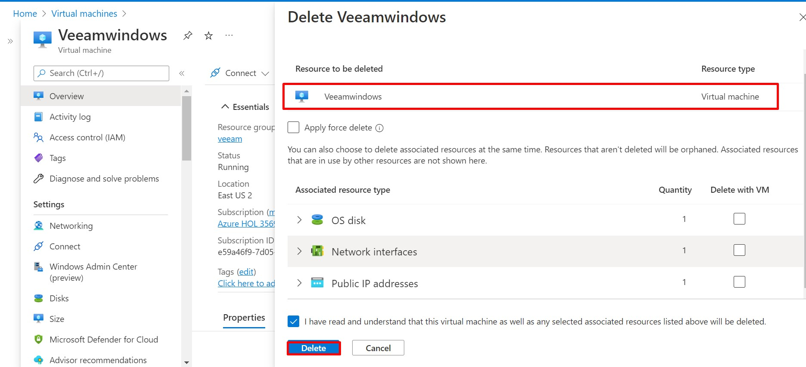

## Restoring the Windows Virtual Machine
1. Select **Protected data** and select the restore point of the Windows VM

2. Select **Restore** and then **Restore VM**
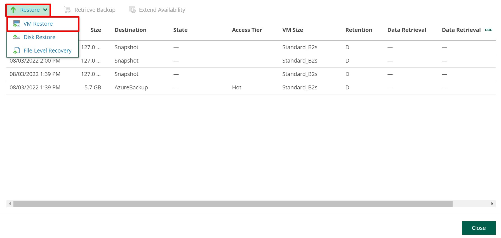
3. Select **VeeamWindows** and Click **Next**

4. Goto **Account**, **Select Account**, and **Select Azure Active Directory**, Click **Apply** and Click **Next**.

5. Go to **Restore Mode** and select the **Restore to Original Location** and click **Next**

6. Go to **Reason** provide the **Restore Reason** and click **Next**
 
7. Go to **Summary** and read through the Description and Click on **Restore**

8. Go to Session Logs and verify that restore is in success state and Verify In the Azure Portal
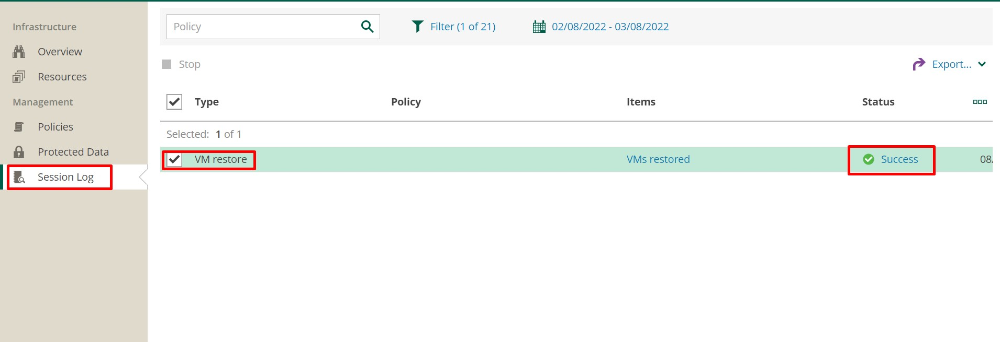

## Azure SQL Backup
1. Move to **Policies**, select the **Azure SQL** and **ADD+**

2. Go to **PolicyInfo** Enter Value For **Name** and **Description** and Click **Next**

3. Select the **Sources** Select the **Azure Active Directory** for Source in the Region select **select region**

4. Select the **Region** and click on **ADD** and click on **Apply**

5. Select the **Resource to Protect**, Clink on **protect the following resources** and **Select Browse to select the specifid resource from global list**
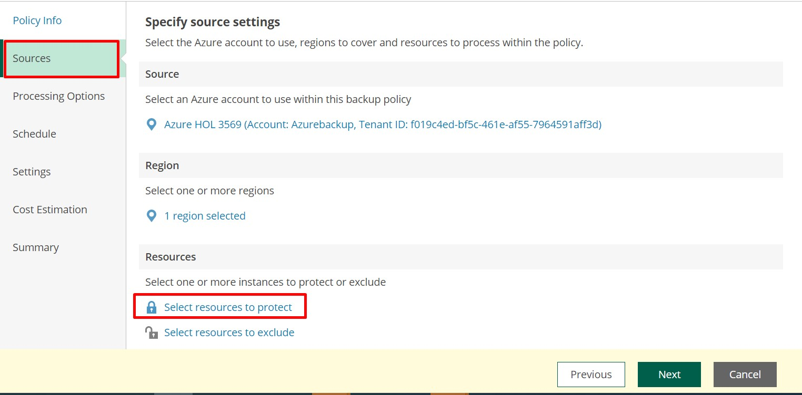

6.Select the checkbox for the **VeeamSQL** and click on **ADD**, Click on **Apply** and click on **Next**
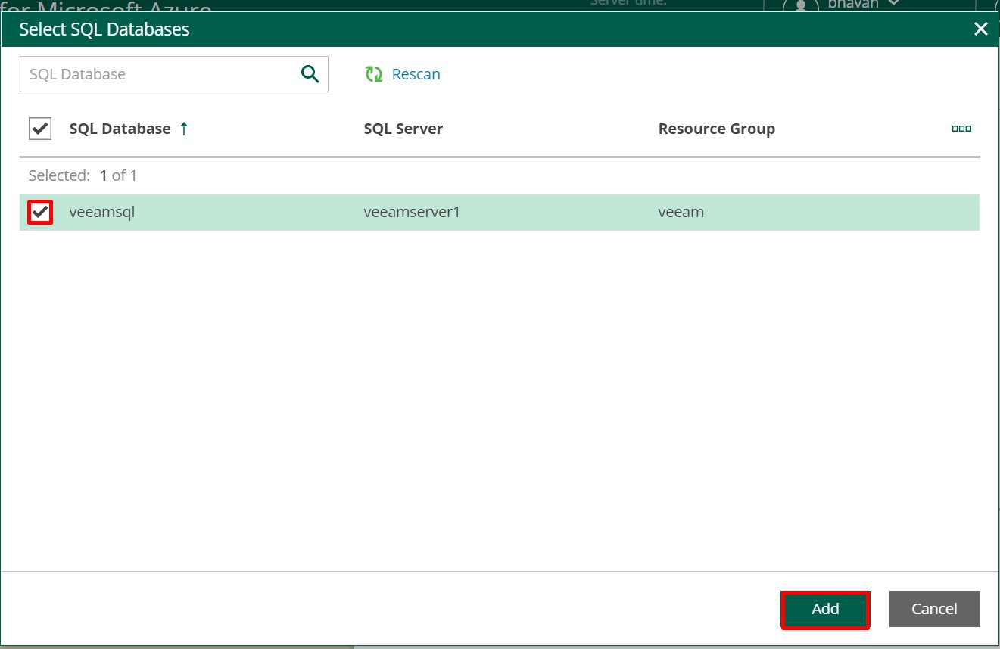
7.Select the **Processing Options**, move to **Use staging servers (recommended for database consistency)** and Click on **select server**

8. Select the **Browse** option for **Staging server** and click on **+ADD** for adding SQL account
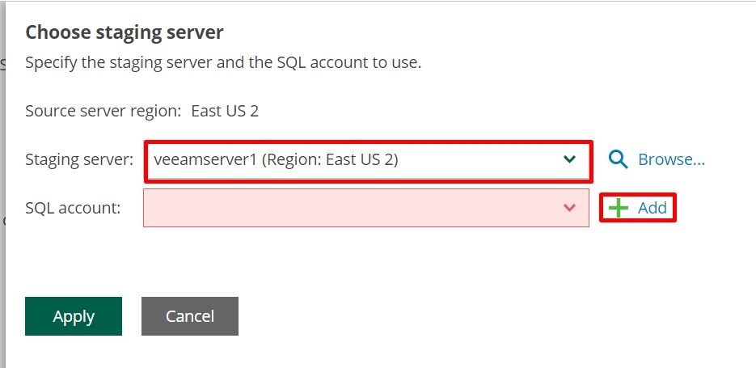
9. Select the **AccountInfo** enter the **Name** and **Description** and click on **Next**

10. Select the Account Enter the **Username** ,**Password** and click **Next**
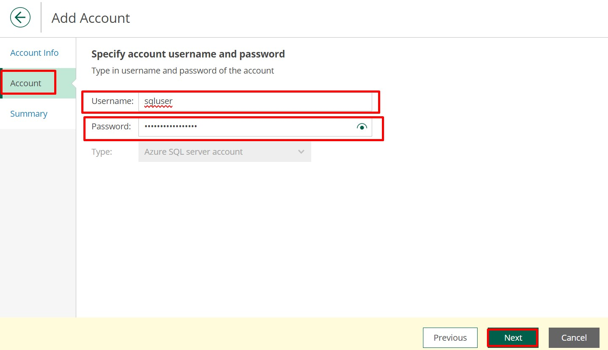
11. Move to **Summary** and click **Next**

12. Select **Apply** and click **Next**

13. Select **Schedule**, Enable radio button for **Daily retention** and **Edit Daily Settings**

14. Select **Repository** for AzureBackup, Click **Apply**  and click **Next**

15. Goto **Settings** and click **Next**

16. Move **Cost Estimation** and click **Next**

17. Move **Summary** and click **Finish**

18. In the **policies**, click on **Azure SQl** and check the **priority**, Click on **Start**
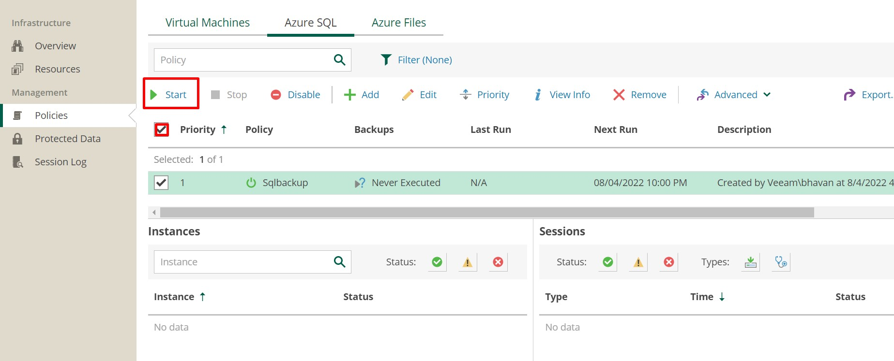
19. Make sure that backup is **Success**

