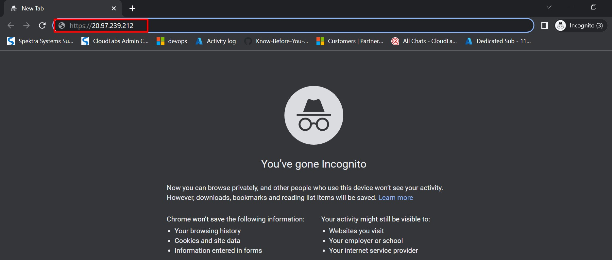
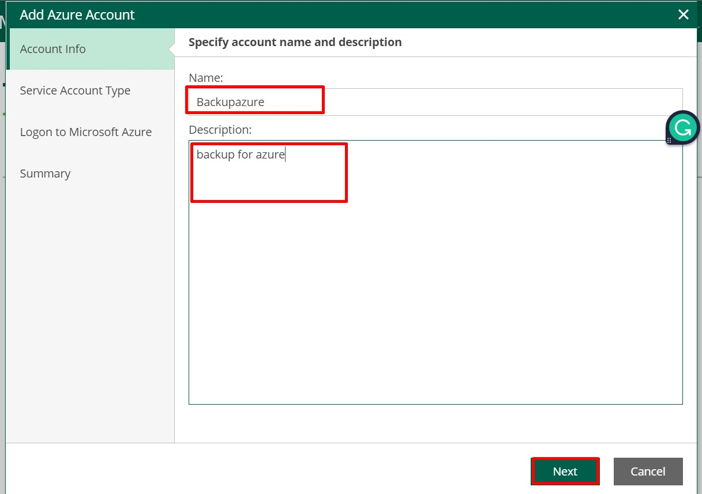
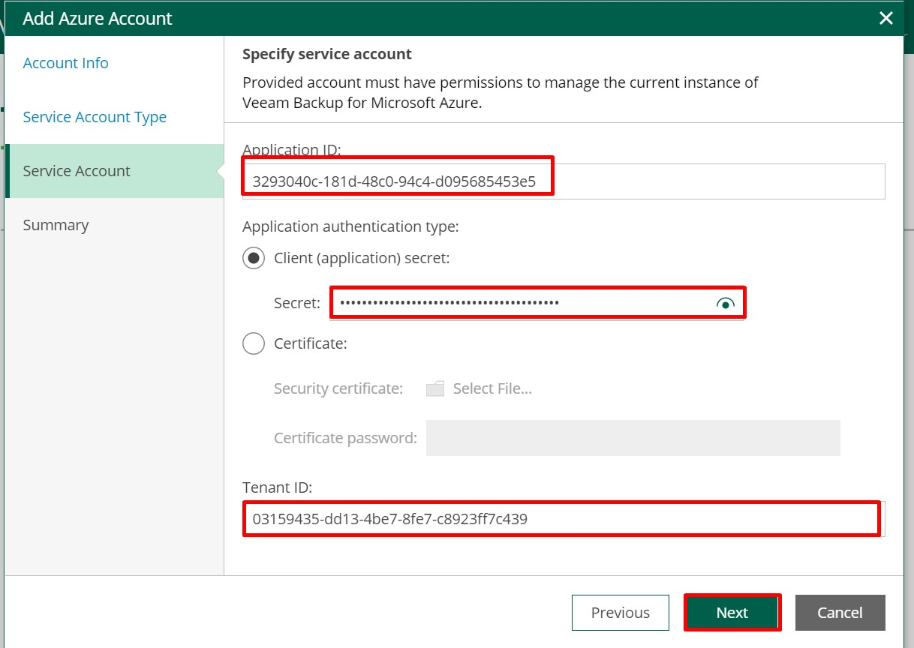

#  Veeam Hands-on Lab for Microsoft Azure
## Login to Veeam VM
1. Copy the Public IP address from the VM and Note the **Username** and **Password** from the azure portal
2. Open the new browser and paste the value copied below and replace the **IPADDRESS** with the Veeam VM IP address
  `````
  https://IPADDRESS
  `````

3. Click on the **advance**

4. Click on the **click on processed to IP**

5. Enter the **Username** and **Password** and click on Login

6. Check all the check boxes in the licence agreement and click on **Accept** and login into the VM


## Add a Microsoft azure account
1. Click on add a microsoft azure account first

2. Click on **Add**

3. Enter the **Name**, **Description** and click on the **Next**

4. In the **Service Account Type** click on **Specify the exisiting service account**

5. Copy the **TenantID**, **Application ID** and **Secret** of service principal from environment details Tab

6. Paste the Copied values in the respective fields and click **Next**

7. Move to the **Summary** and click **Finish** to setup the microsoft account

